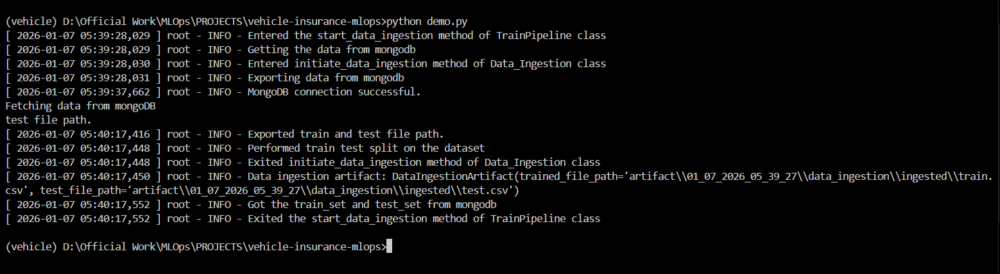
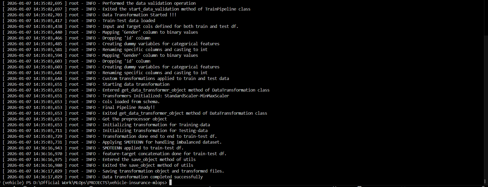
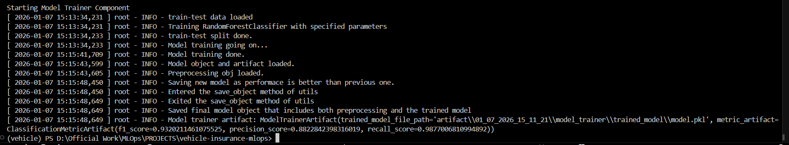
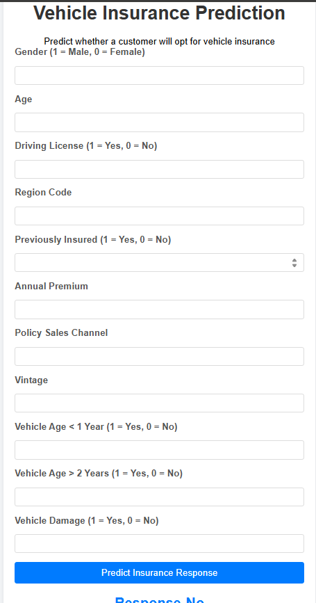

# MLOps Project - Vehicle Insurance Data Pipeline

[](https://github.com/YOUR_USERNAME/vehicle-insurance-mlops/actions/workflows/ci-cd.yml)
[](https://github.com/YOUR_USERNAME/vehicle-insurance-mlops/actions/workflows/docker.yml)
[](https://www.python.org/downloads/release/python-3100/)
[](https://opensource.org/licenses/MIT)

End-to-end production-style MLOps pipeline for vehicle insurance prediction, built to demonstrate real-world machine learning system design, pipeline orchestration, data reliability, and deployment readiness.

---

## Project Overview

This project focuses on the **importance of MLOps** rather than just model building.  
It demonstrates how machine learning workflows are structured, validated, versioned, and served in a production-like environment.

The system predicts whether a customer is likely to opt for vehicle insurance based on demographic and policy-related features.

---
## 📌 Project Structure

```text
vehicle-insurance-mlops/
│
├── app.py                      # FastAPI entry point for prediction service
├── Dockerfile                  # Docker configuration for deployment
├── requirements.txt            # Project dependencies
├── setup.py                    # Package setup
├── pyproject.toml              # Build system configuration
├── README.md                   # Project documentation
│
├── config/
│   ├── schema.yaml             # Dataset schema definition
│   └── model.yaml              # Model & training configuration
│
├── artifact/                   # Versioned pipeline outputs (timestamp-based)
│   └── <timestamp>/
│       ├── data_ingestion/     # Raw & split datasets
│       ├── data_validation/    # Validation reports
│       ├── data_transformation/# Transformed data & preprocessors
│       └── model_trainer/      # Trained model artifacts
│
├── logs/                       # Centralized pipeline execution logs
│
├── notebook/
│   └── data.csv                # Sample / reference dataset
│
├── src/
│   ├── components/             # Core ML pipeline components
│   │   ├── data_ingestion.py
│   │   ├── data_validation.py
│   │   ├── data_transformation.py
│   │   ├── model_trainer.py
│   │   ├── model_evaluation.py
│   │   └── model_pusher.py
│   │
│   ├── pipeline/               # Training & prediction pipelines
│   │   ├── training_pipeline.py
│   │   └── prediction_pipeline.py
│   │
│   ├── entity/                 # Configuration & artifact data classes
│   ├── configuration/          # MongoDB / AWS connection logic
│   ├── cloud_storage/          # AWS S3 interaction layer
│   ├── data_access/            # Data fetching layer
│   ├── utils/                  # Common utility functions
│   ├── logger/                 # Centralized logging module
│   └── exception/              # Custom exception handling
│
├── static/
│   └── css/
│       └── style.css           # UI styling
│
└── templates/
    └── vehicledata.html        # HTML template for prediction UI

```


## Why This Is an MLOps Project

This is not a notebook-only ML project.  
It showcases how real ML systems are built with:

- Modular pipeline architecture
- Data ingestion from external sources
- Schema-based data validation
- Feature engineering and preprocessing pipelines
- Model training with evaluation
- Versioned artifacts
- Centralized logging and exception handling
- API-based prediction service
- Dockerized local deployment

The emphasis is on **reproducibility, reliability, and maintainability**.

---

## End-to-End Workflow

MongoDB  
→ Data Ingestion  
→ Data Validation (Schema-based)  
→ Data Transformation & Feature Engineering  
→ Model Training & Evaluation  
→ Prediction Pipeline (FastAPI)  
→ Dockerized Local Deployment  

---

## Data Source

- MongoDB Atlas is used as the data source
- Data is fetched dynamically using environment variables
- No hardcoded credentials are used


---

## Pipeline Components

### Data Ingestion
- Fetches data from MongoDB
- Performs train-test split
- Stores datasets as versioned artifacts

- 

### Data Validation
- Schema validation using a predefined schema file
- Checks required columns and data types
- Generates validation reports as artifacts

- 

### Data Transformation
- Feature engineering
- Encoding categorical variables
- Scaling numerical features
- Handling class imbalance using SMOTEENN
- Saves preprocessing pipeline for reuse

- 

### Model Training
- Model trained using RandomForestClassifier
- Evaluated using precision, recall, and F1-score
- Best-performing model saved as a versioned artifact





---

## Prediction Service

- Built using FastAPI
- HTML-based form for user input
- Accepts customer details
- Returns prediction result:
  - Response-Yes
  - Response-No
 
  - 

The prediction pipeline reuses the trained model and preprocessing object to ensure consistency.

---

<p align="center">
  
</p>


---

## 🚀 CI/CD Pipeline

This project includes a complete CI/CD pipeline using **GitHub Actions**:

### Automated Workflows

1. **CI/CD Pipeline** (`.github/workflows/ci-cd.yml`)
   - Runs on every push to main/master branch
   - **Testing**: Linting with flake8, unit tests with pytest
   - **Build**: Docker image creation with caching
   - **Push**: Automated push to Docker Hub (if configured)
   - **Deploy**: Deployment hooks (configure for your platform)

2. **Docker Build & Test** (`.github/workflows/docker.yml`)
   - Validates Dockerfile changes
   - Tests container health endpoint
   - Security scanning with Trivy

### Setup CI/CD

1. **GitHub Secrets** (Required for Docker Hub push):
   ```
   DOCKER_USERNAME: your-dockerhub-username
   DOCKER_PASSWORD: your-dockerhub-token
   ```

2. **Pre-commit Hooks** (Optional but recommended):
   ```bash
   pip install pre-commit
   pre-commit install
   ```

3. **Run Tests Locally**:
   ```bash
   pytest tests/ --cov=src --cov-report=term
   ```

---

## Docker Usage

### Using Docker Compose (Recommended)
```bash
docker-compose up -d
```

Access at http://localhost:5000

Stop:
```bash
docker-compose down
```

### Manual Docker Build & Run
```bash
docker build -t vehicle-insurance-mlops:latest .
docker run -p 5000:5000 vehicle-insurance-mlops:latest
```

### With Volume Mounts (for artifacts)
```bash
docker run -p 5000:5000 \
  -v "$(pwd)/artifact:/app/artifact" \
  -v "$(pwd)/logs:/app/logs" \
  --env-file .env \
  vehicle-insurance-mlops:latest
```


