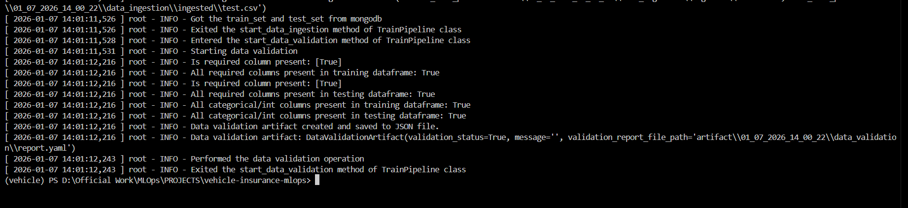
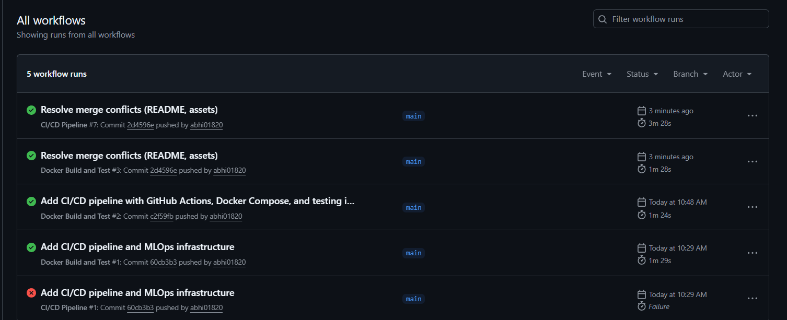

# 🚗 Vehicle Insurance – End-to-End MLOps Project

---

## 📌 Project Overview

This repository contains a **complete, production-style MLOps pipeline** built to demonstrate how real-world machine learning systems are designed, automated, validated, versioned, and deployed.

The focus of this project is **MLOps**, not just model training.
It showcases the full lifecycle of a machine learning system — from raw data ingestion to automated CI/CD and containerized deployment.

The system predicts whether a customer is likely to opt for **vehicle insurance** based on demographic and policy-related features.

---

## 🎯 Why This Is a Complete MLOps Project

This is **not** a notebook-only ML project.

It implements industry-grade MLOps practices such as:

- Modular ML pipeline architecture
- External data ingestion (MongoDB Atlas)
- Schema-based data validation
- Feature engineering & preprocessing pipelines
- Model training and evaluation
- Versioned artifacts (timestamp-based)
- Centralized logging and exception handling
- Reusable prediction pipeline
- FastAPI-based inference service
- Dockerized execution environment
- CI/CD automation using GitHub Actions
- Secure secrets management (no hardcoded credentials)

---

## 🏗️ End-to-End Architecture
```
MongoDB Atlas
↓
Data Ingestion
↓
Data Validation (Schema-based)
↓
Data Transformation & Feature Engineering
↓
Model Training & Evaluation
↓
Model Pusher (Artifacts)
↓
Prediction Pipeline (FastAPI)
↓
Dockerized Deployment
↓
CI/CD Automation (GitHub Actions)
```


---

## 📂 Project Structure

```text
vehicle-insurance-mlops/
│
├── .github/
│   └── workflows/
│       ├── ci-cd.yml               # CI/CD pipeline (tests, build, push)
│       └── docker.yml              # Docker build & validation
│
├── app.py                          # FastAPI entry point
├── Dockerfile                      # Docker configuration
├── requirements.txt                # Dependencies
├── setup.py                        # Package setup
├── pyproject.toml                  # Build system config
├── README.md                       # Project documentation
│
├── config/
│   ├── schema.yaml                 # Dataset schema
│   └── model.yaml                  # Model configuration
│
├── artifact/                       # Versioned pipeline outputs
│   └── <timestamp>/
│       ├── data_ingestion/
│       ├── data_validation/
│       ├── data_transformation/
│       └── model_trainer/
│
├── logs/                           # Centralized logs
│
├── notebook/
│   └── data.csv                    # Reference dataset
│
├── src/
│   ├── components/                 # Core ML components
│   │   ├── data_ingestion.py
│   │   ├── data_validation.py
│   │   ├── data_transformation.py
│   │   ├── model_trainer.py
│   │   ├── model_evaluation.py
│   │   └── model_pusher.py
│   │
│   ├── pipeline/                   # Training & prediction pipelines
│   │   ├── training_pipeline.py
│   │   └── prediction_pipeline.py
│   │
│   ├── entity/                     # Artifact & config data classes
│   ├── configuration/              # MongoDB / cloud config
│   ├── cloud_storage/              # AWS S3 integration layer
│   ├── data_access/                # Data fetching layer
│   ├── utils/                      # Utility functions
│   ├── logger/                     # Centralized logging
│   └── exception/                  # Custom exceptions
│
├── static/
│   └── css/
│       └── style.css
│
└── templates/
    └── vehicledata.html             # Prediction UI


```

## 🔍 Pipeline Components

## 1️⃣ Data Ingestion
Fetches data from MongoDB Atlas

Performs train-test split

Stores versioned datasets as artifacts


 ## 2️⃣ Data Validation

Schema validation using schema.yaml

Column presence, datatype, and missing value checks

Generates validation reports




## 3️⃣ Data Transformation

Feature engineering

Encoding categorical variables

Scaling numerical features

Class imbalance handling using SMOTEENN

Saves preprocessing pipeline for reuse


## 4️⃣ Model Training & Evaluation

Model: RandomForestClassifier

Metrics: Precision, Recall, F1-Score

Best model selected and saved as artifact


## 🐳 Dockerized Deployment
Build & Run
```

docker build -t vehicle-insurance-mlops .
docker run -p 5000:5000 vehicle-insurance-mlops
```

## 🔁 CI/CD Pipeline (GitHub Actions)

This project includes fully automated CI/CD pipelines.

### ✅ CI/CD Workflow (ci-cd.yml)

Triggered on every push

Code checkout

Linting & testing

Docker image build

Docker Hub push using secrets

### ✅ Docker Workflow (docker.yml)

Dockerfile validation

Image build

Container health check

Security scanning



## 🚀 Prediction Service

Built using FastAPI

HTML-based input form

Reuses trained model and preprocessing pipeline

Returns prediction:

Response-Yes

Response-No

Ensures training-serving consistency.

<p align="center">
  
</p>
